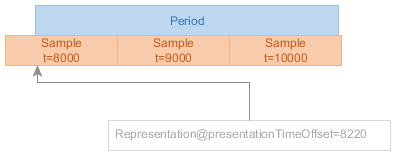

# Example content # {#introduction}

The text of the document is mostly authored using Markdown syntax. You can use *italicized text*, **bold text**, [hyperlinks](https://example.com) and `inline code blocks`.

There are unordered lists:

* Pollen
* Honey
* Bees
* Work

And there are ordered lists:

1. Aardvark
1. Abacus
1. Academic
	1. Subitems work in lists, too
	1. The list numbering is automatic

Block formatting can be useful for quotes and excerpts:

> [Lorem ipsum dolor sit amet](https://en.wikipedia.org/wiki/Lorem_ipsum), consectetur adipiscing elit.
> Vivamus tellus dolor, porttitor ut elit sed, vestibulum maximus velit.
> Maecenas at sollicitudin neque. Sed eu risus ullamcorper:
> * porttitor lacus at
> * convallis nunc
> * suspendisse id dolor urna
> * quervos murat
> * curabitur in eros diam

In quote blocks, you can still use all regular formatting. To disable formatting, use code blocks (see below).

There is a special syntax for "key-value" lists:

: key
:: value

: another key
:: another value

## Special formatting of informative examples and notes ## {#notes-examples}

Note: if a paragraph starts with "Note: " it gets special highlighting and block formatting. These paragraphs are considered informative.

Some paragraphs might be marked as informative examples.

## Including code/XML snippets ## {#code}

There is a special syntax for code blocks. This disables markup processing:

<xmp highlight="xml">
<!DOCTYPE html>
<html lang="en">
<head>
	<meta charset="utf-8">
	<title>Example website</title>
</head>

<body id="home">
	<h1>HTML5!</h1>
</body>
</html>
</xmp>

## References ## {#document-references}

There is a shortcut syntax for cross references to chapters in the same document: [[#introduction]]

There is a shortcut syntax for referencing well-known documents (RFCs etc) that are published on [SpecRef](https://www.specref.org/). For example, [[rfc2324]] is an important one.

Note: You can also change the reference text and just call it [[rfc2324|the coffee pot RFC]].

There is a slightly different shortcut syntax for normative references [[!DASH-SystemIDs]].

# Some things require HTML # {#html}

Tables are defined as HTML.

<!-- class=def is a builtin style that makes for nice looking tables; you can remove this attribute for more plain tables -->
<table class="def">
	<tr>
		<th>Usage</th>
		<th>Algorithm</th>
	</tr>
	<tr>
		<td>Content Key wrapping</td>
		<td>AES256-CBC, PKCS #7 padding</td>
	</tr>
	<tr>
		<td>Encrypted key MAC</td>
		<td>HMAC-SHA512</td>
	</tr>
</table>

Images are also inserted as HTML.

<figure>
	
	<figcaption>Just a random static example image.</figcaption>
</figure>

# Automatic diagram generation # {#diagrams-auto}

Diagrams can be automatically generated from text files. See content of `Diagrams/` subdirectory for diagram source code.

<figure>
	
	<figcaption>Example for PlantUML component diagram.</figcaption>
</figure>

<figure>
	
	<figcaption>Example for PlantUML sequence diagram.</figcaption>
</figure>

# Manual diagrams # {#diagrams-manual}

Diagrams can also be managed manually, treated as static images. Often these are yEd diagrams (.graphml files) that are manually exported to PNG.

<figure>
	
	<figcaption>Example yEd diagram.</figcaption>
</figure>

# Defining terms # {#definitions}

The <dfn>Bikeshed document compiler</dfn> has a special syntax for various types of term/element definitions. This syntax enables easy cross-refrencing and building of the terminology index.

Terms can be defined either inline (as [=Bikeshed document compiler=] above) or in a key-value list:

: <dfn>foo</dfn>
:: bar

: <dfn>baz</dfn>
:: woo

Using term reference syntax will link back to the definition of the term: [=foo=] or [=baz=].

Note: every term must be referenced and every reference must point to a valid term. Terms with 0 references will result in a build error, just the same as broken references.

Use a pipe character to specify custom text for the generated link (e.g. for grammatical purposes):

Two [=baz|bazes=] are better than three [=foo|foos=]!

# Defining data structures # {#definitions-datastructures}

If your document defines data structures or languages, you will generally want to use the HTML/XML reference syntax of Bikeshed.

Consider the following XML structure consisting of <{bookstore}> and <{book}> elements:

<xmp highlight="xml">
<bookstore name="Ye Olde Booke Shoppe">
	<book title="Machine Learning for Machines" />
	<book title="List of letters in the English alphabet, 2nd ed" />
</bookstore>
</xmp>

The data structures in this snippet can be defined as the examples below illustrate. This type of definition allows easy referencing of elements and their children (e.g. <{book/title}>).

Note: the data structure syntax shown here is not ideal but it is the closest we can get to a general-purpose Bikeshed data structure syntax that still enables automatic references. Notably, we cannot easily differentiate between XML element children and attributes.

## <dfn element>bookstore</dfn> element ## {#schema-bookstore}

The root element of the bookstore document format.

<dl dfn-type="element-attr" dfn-for="bookstore">

: <dfn>name</dfn> (required, xs:string)
:: The human readable name of the bookstore.

: <dfn>book</dfn> (0...N, <{book}>)
:: Any number of books made available by the bookstore.

</dl>

## <dfn element>book</dfn> element ## {#schema-book}

Defines one book that is published in a bookstore.

<dl dfn-type="element-attr" dfn-for="book">

: <dfn>title</dfn> (required, xs:string)
:: The human readable title of the book.

</dl>

# Remember, this is Bikeshed not Markdown! # {#bikeshed-is-not-markdown}

Many editors have "Markdown preview" functions that will not be a 100% match to what will really be generated from the source code of this document. Do not be surprised if there are formatting differences.

<!-- Document metadata follows. The below sections are used by the document compiler and are not directly visible. -->

<pre class="metadata">
Revision: 1.0

Title: Example Document
Status: LD
Shortname: example
URL: https://example.com/where/is/this/document/published/
Issue Tracking: GitHub https://github.com/Dash-Industry-Forum/DocumentAuthoringExample/issues
Repository: https://github.com/Dash-Industry-Forum/DocumentAuthoringExample GitHub
Editor: DASH Industry Forum

Default Highlight: text
<!-- Enabling line numbers breaks code blocks in PDF! (2018-10-02) -->
Line Numbers: off
Markup Shorthands: markdown yes
Boilerplate: copyright off, abstract off
Abstract: None
</pre>

<!-- Example of custom bibliography entries. Prefer adding your document to SpecRef over maintaining a custom definition. -->
<pre class="biblio">
{
	"DASH-SystemIDs": {
		"href": "https://dashif.org/identifiers/protection/",
		"title": "DASH-IF registry of DRM System IDs.",
		"publisher": "DASH Industry Forum"
	}
}
</pre>

<pre boilerplate="logo">

</pre>